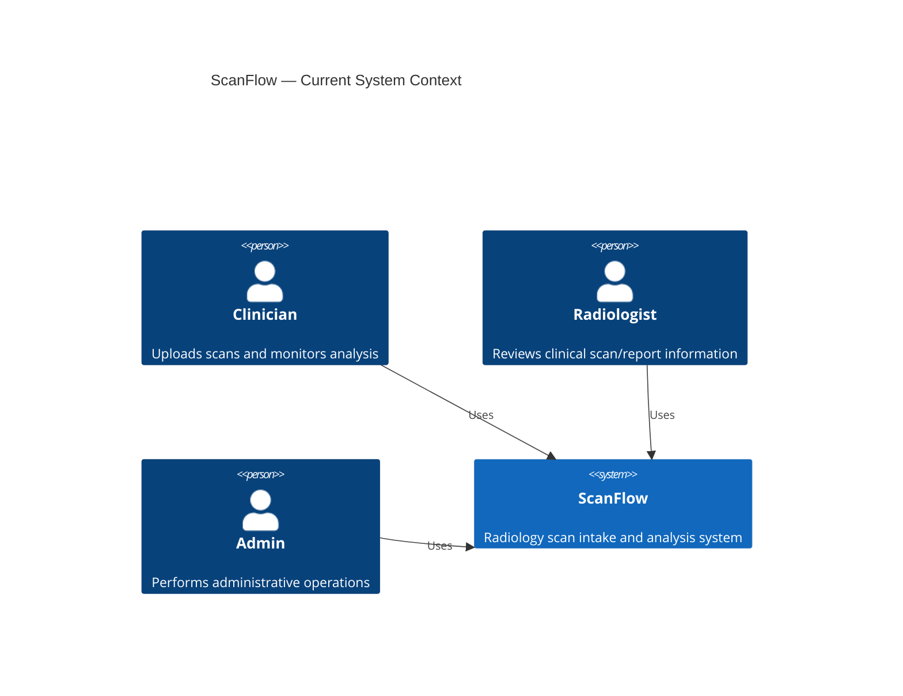
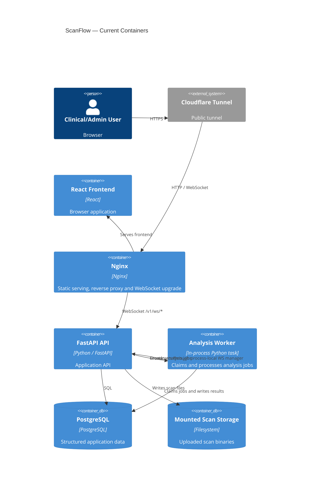
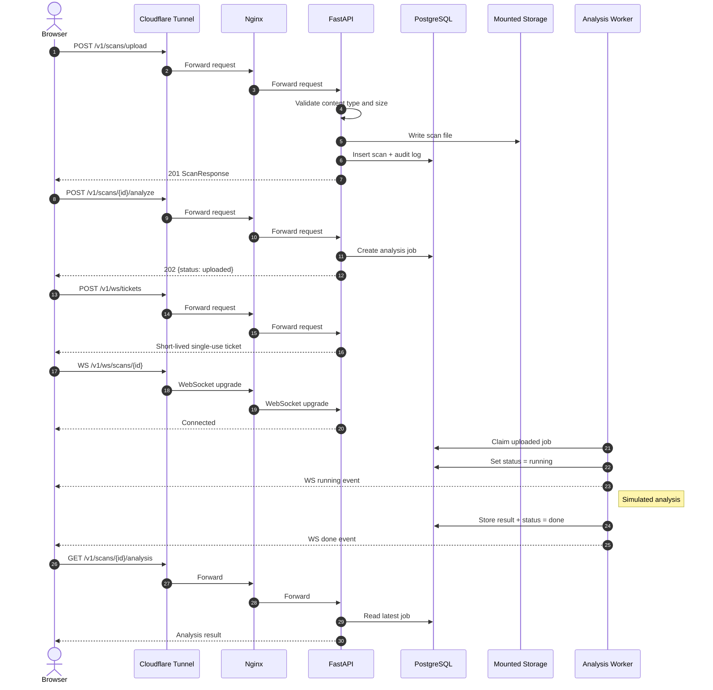
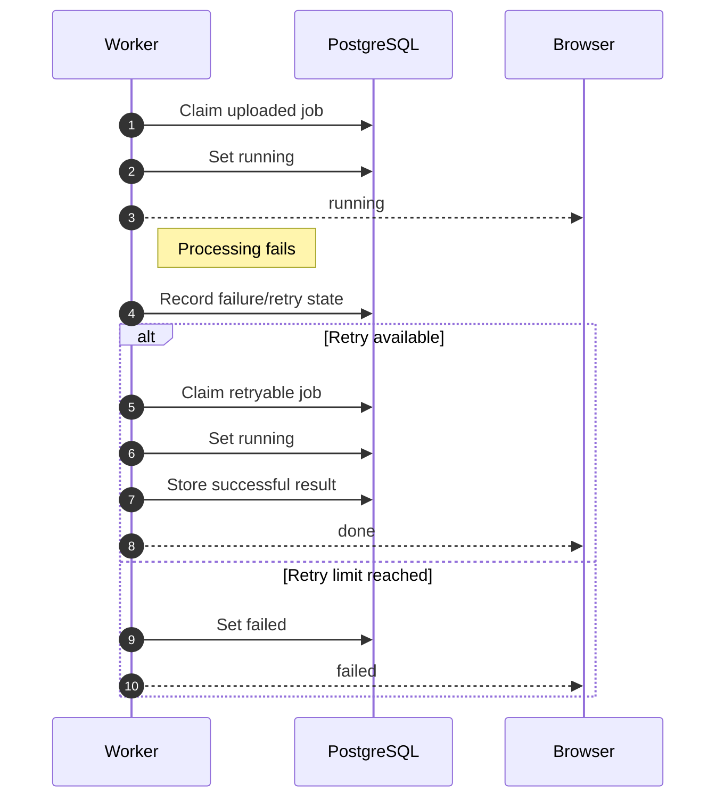
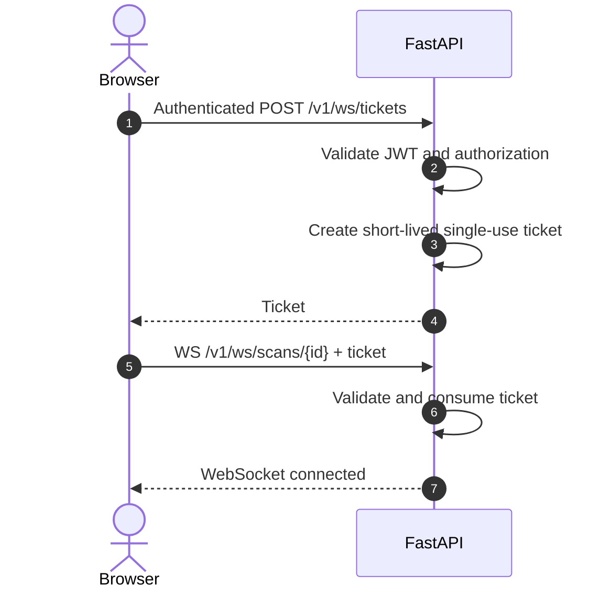

# ScanFlow — System Architecture

> **Day 38 architecture review**
>
> This document preserves the original architecture decisions from Day 16 and records how the implementation evolved. The historical design is not deleted or rewritten as if it never existed. Instead, each important divergence is identified and the current architecture is documented separately.
>
> **Current implementation:** React frontend → Cloudflare Tunnel → Nginx → FastAPI → PostgreSQL + mounted local scan storage, with an in-process analysis worker and WebSocket status delivery.
>
> **Future storage migration:** S3-compatible storage through boto3, tested locally with moto. S3 is not the current production storage implementation.

---

# 1. Historical Design — Day 16

The Day 16 design established the original architectural direction for ScanFlow:

- REST API under `/v1`.
- FastAPI backend.
- JWT authentication and role-based authorization.
- PostgreSQL for structured data.
- Scan files separated from structured database data.
- Asynchronous analysis instead of blocking the upload request.
- Background worker for analysis.
- Containerized deployment.
- Nginx/reverse proxy and external access were planned as the system evolved.
- Object storage such as S3 was considered the longer-term direction for scan files.
- Capacity and failure modes were considered before production scale.

This original design remains useful as the baseline for comparing what was eventually implemented.

---

# 2. Day 16 → Current Implementation Divergences

## 2.1 Database

### Originally planned

The early architecture described an initial in-memory implementation and PostgreSQL as a later persistence component.

### Current

PostgreSQL is now an actual running service in Docker Compose.

```text
FastAPI
   │
   ▼
PostgreSQL 17
```

The API now persists patients, scans, analysis jobs/results, users, and audit information.

---

## 2.2 Authentication and authorization

### Originally planned

JWT authentication and role-based access control were part of the API design.

### Current

Authentication and authorization are implemented.

Current roles:

- `clinician`
- `radiologist`
- `admin`

Protected endpoints use the authenticated user and role checks.

---

## 2.3 Nginx

### Originally planned

Nginx/reverse proxy was part of the later infrastructure design.

### Current

Nginx is running in Docker Compose.

The current path is:

```text
Browser
   ↓
Nginx :80
   ↓
FastAPI
```

The host mapping is:

```text
localhost:8000 → Nginx:80
```

Nginx also serves the frontend static files.

---

## 2.4 Docker Compose

### Originally planned

Containerization was part of the evolution of the project.

### Current

The running Compose stack contains:

```text
api
db
nginx
```

with PostgreSQL backed by a Docker volume.

The analysis worker currently runs inside the FastAPI API process rather than as a separate worker container.

---

## 2.5 Cloudflare Tunnel

### Originally planned

External access was a later infrastructure concern.

### Current

Cloudflare Tunnel has been configured and verified.

The public path is effectively:

```text
Browser
   ↓
Cloudflare Tunnel
   ↓
Nginx
   ↓
FastAPI
```

WebSocket traffic through the tunnel was also verified.

---

## 2.6 Scan file storage

### Originally planned

The architecture separated scan files from structured PostgreSQL data and identified object storage/S3 as the longer-term direction.

### Current

Files are currently stored on the mounted local volume:

```text
uploads/scans/
```

PostgreSQL stores the generated file key, for example:

```text
scans/<scan-id>.pdf
```

The database does not store the scan binary.

### Later

Day 38 moves this storage implementation toward:

```text
FastAPI
   ↓
boto3
   ↓
S3-compatible API
   ↓
moto for tests
```

This is a **future migration**, not the current storage architecture.

---

## 2.7 Upload validation

### Originally planned

The early API design specified scan upload but did not contain all of the validation that was eventually implemented.

### Current

Uploads accept:

```text
image/jpeg
image/png
application/pdf
```

Maximum size:

```text
20 MB
```

The implementation also removes a partially written file if an exception occurs during upload.

---

## 2.8 Upload endpoint

### Originally designed

```http
POST /v1/scans
```

### Current

```http
POST /v1/scans/upload
```

The current upload requires:

```text
patient_id
modality
body_part
acquired_at
file
```

---

## 2.9 File field

### Originally designed

The API documentation referred to a file path.

### Current

The API returns:

```json
{
  "file_key": "scans/<scan-id>.pdf"
}
```

The application exposes a storage key rather than exposing its local filesystem path.

---

## 2.10 Analysis worker

### Originally planned

A background worker was planned for asynchronous analysis.

### Current

An actual in-process worker exists.

The worker:

1. Finds available jobs.
2. Claims jobs using PostgreSQL row locking.
3. Sets the job to `running`.
4. Performs the simulated analysis.
5. Writes the result.
6. Broadcasts the status.
7. Handles retries/failures.

Job claiming uses:

```sql
FOR UPDATE SKIP LOCKED
```

---

## 2.11 Analysis lifecycle

### Originally documented

The early API design used a `pending` state.

### Current

The actual lifecycle is:

```text
uploaded
    ↓
running
    ↓
done
```

or:

```text
uploaded
    ↓
running
    ↓
failed
```

The worker also has stale-running-job recovery.

---

## 2.12 Worker recovery

### Originally

A worker failure could leave a job stuck in `running`.

### Current

The worker detects stale running jobs and can return them to a retryable state.

This means the current architecture is more resilient than the original design.

---

## 2.13 WebSocket status delivery

### Originally

The API design primarily relied on HTTP polling for analysis status.

### Current

A WebSocket status path has been implemented:

```text
POST /v1/ws/tickets
          ↓
short-lived ticket
          ↓
WS /v1/ws/scans/{id}
          ↓
running / done / failed events
```

The worker broadcasts analysis transitions to connected clients.

---

## 2.14 WebSocket authentication

### Originally

There was no completed WebSocket ticket mechanism in the Day 16/27 API contract.

### Current

The browser does not put the normal JWT into the WebSocket URL.

Instead:

```text
Authenticated HTTP request
          ↓
POST /v1/ws/tickets
          ↓
single-use ticket
          ↓
WebSocket connection
```

The ticket is short-lived, approximately 30 seconds, and bound to the authorized user/scan context.

---

## 2.15 WebSocket process limitation

### Current limitation

The connection manager is process-local.

One API process can broadcast to sockets connected to that process.

If the API is later scaled across multiple processes/containers, broadcasts will need shared infrastructure.

### Future production direction

A shared broker such as Redis Pub/Sub could distribute events across processes.

Redis is intentionally **not being built for the current training task**.

---

## 2.16 Frontend polling

### Originally

Polling was the primary analysis-status mechanism.

### Current

WebSocket is available for live status delivery, but HTTP polling remains as a fallback and measurement path.

The polling implementation uses increasing delays:

```text
2s
4s
8s
15s maximum
```

It stops on:

- `done`
- `failed`
- component unmount
- maximum attempts

---

## 2.17 WebSocket resilience

The frontend now handles:

- unexpected disconnects
- exponential reconnect backoff
- reconnect ceiling
- terminal-state stopping
- offline → online recovery
- background → foreground recovery
- cleanup when the component unmounts

These behaviors were not part of the original Day 16 architecture.

---

## 2.18 Nginx WebSocket configuration

Nginx now explicitly supports WebSocket upgrade:

```nginx
location /v1/ws/ {
    proxy_http_version 1.1;
    proxy_set_header Upgrade $http_upgrade;
    proxy_set_header Connection "upgrade";
    proxy_set_header Host $host;
    proxy_set_header X-Real-IP $remote_addr;
    proxy_set_header X-Forwarded-For $proxy_add_x_forwarded_for;
    proxy_set_header X-Forwarded-Proto $scheme;
    proxy_set_header X-Request-ID $request_id;
    proxy_read_timeout 300s;
    proxy_send_timeout 30s;
    proxy_pass http://api:80;
}
```

This is now part of the real deployment path.

---

## 2.19 Audit logging

The current scan upload flow writes an audit record when the scan is created.

The audit entry records:

```text
action
entity
entity_id
actor_id
```

This is now part of the actual persistence flow.

---

# 3. Current System

The architecture that actually exists today is:

```text
                         Internet
                            │
                            ▼
                   Cloudflare Tunnel
                            │
                            ▼
                         Nginx
                      /          \
                     /            \
                    ▼              ▼
             React frontend     FastAPI
                                  │
                    ┌─────────────┼─────────────┐
                    │             │             │
                    ▼             ▼             ▼
               PostgreSQL    Local uploads    Analysis
                                              worker
                                                 │
                                                 ▼
                                         WebSocket manager
                                                 │
                                                 ▼
                                              Browser
```

The current system is therefore no longer the original simple in-memory API design.

---

# 4. Current Components

## 4.1 React frontend

Responsibilities:

- user interface
- authentication interaction
- patient/scan operations
- analysis status display
- WebSocket connection/reconnection
- polling fallback

---

## 4.2 Cloudflare Tunnel

Provides external access to the local deployment.

It also supports the WebSocket path that was verified during Day 37.

---

## 4.3 Nginx

Responsibilities:

- frontend static file serving
- HTTP reverse proxy
- WebSocket upgrade
- request forwarding
- timeout configuration

---

## 4.4 FastAPI

Responsibilities:

- authentication
- authorization
- patients
- scans
- uploads
- analysis jobs
- WebSocket tickets
- WebSocket connections
- audit logging

---

## 4.5 PostgreSQL

Stores structured application state:

- users
- patients
- scans
- analysis jobs/results
- audit records

---

## 4.6 Local mounted storage

Stores the uploaded scan binaries.

Current location:

```text
uploads/scans/
```

PostgreSQL stores only the corresponding key.

---

## 4.7 Analysis worker

The worker is currently in-process.

It:

- claims jobs
- updates status
- performs analysis
- stores results
- retries failures
- recovers stale jobs
- broadcasts status events

---

# 5. Data Storage

```text
                ScanFlow
                   │
          ┌────────┴────────┐
          │                 │
          ▼                 ▼
     PostgreSQL        Mounted volume
          │                 │
          │                 └── scan image/PDF
          │
          ├── patient data
          ├── scan metadata
          ├── analysis jobs
          ├── analysis results
          ├── users
          └── audit records
```

The database stores:

```text
file_key = scans/<uuid>.<extension>
```

not the actual scan binary.

---

# 6. Synchronous vs Asynchronous Work

## Synchronous

The HTTP request handles:

- authentication
- authorization
- validation
- metadata persistence
- scan file write
- audit logging

## Asynchronous

Analysis runs after the HTTP request:

```text
POST /v1/scans/{id}/analyze
              ↓
        create job
              ↓
        HTTP 202
              ↓
        worker claims job
              ↓
           running
              ↓
             done
```

---

# 7. Current System Context Diagram



---

# 8. Current Container Diagram



---

# 9. Upload → Analyze → WebSocket Sequence



---

# 10. Failure and Retry Sequence



---

# 11. WebSocket Authentication Flow



The normal JWT is not placed in the WebSocket URL.

---

# 12. Capacity Estimate

The current analysis worker is a single serial in-process worker.

Assuming approximately four seconds of analysis work per scan:

```text
200 scans/day
≈ 800 seconds/day
≈ 13.3 worker-minutes/day
```

This is comfortably within a single worker's capacity.

At:

```text
20,000 scans/day
≈ 80,000 seconds/day
≈ 22.2 worker-hours/day
```

a single worker would have essentially no useful capacity margin.

The first major scale concern is therefore worker concurrency.

The second major concern is file storage.

At a maximum of 20 MB per upload:

```text
20,000 × 20 MB
≈ 400 GB/day
```

This is one reason the S3 migration is the appropriate future storage direction.

---

# 13. Failure Modes

| Component | Failure | User impact | Recovery |
|---|---|---|---|
| Nginx | Container stops | Requests unavailable | Container restart |
| FastAPI | Process stops | API/WS unavailable | Process/container restart |
| PostgreSQL | Database unavailable | DB-backed operations fail | Database/container recovery |
| Worker | Process/task stops | Analysis may pause | Stale job recovery when worker resumes |
| Local storage | Volume unavailable | Scan upload/read fails | Depends on volume availability/backups |
| Cloudflare Tunnel | Tunnel stops | Public access unavailable | Tunnel restart/recovery |
| WebSocket | Client/network disconnects | Live events stop | Frontend reconnects |
| Multiple API processes | Process-local WS manager | Cross-process broadcasts unavailable | Future shared broker |

---

# 14. Current Limitations

## 14.1 Process-local WebSocket manager

Current:

```text
one API process
      ↓
one connection manager
      ↓
connected browsers
```

Future multi-process deployment requires shared event infrastructure.

---

## 14.2 Local file storage

Current files depend on the mounted local volume.

Future storage should use S3-compatible object storage.

---

## 14.3 Single analysis worker

The current worker is intentionally serial.

Higher load will require multiple workers.

The existing PostgreSQL job-claiming design is intended to support that direction.

---

## 14.4 WebSocket dependency

WebSockets can be affected by proxies, firewalls, background browser behavior, or network changes.

Therefore HTTP polling remains available as a fallback.

---

# 15. Future S3 Migration

The intended next storage architecture is:

```text
                    Current
FastAPI ────────────────→ mounted volume


                    Future
FastAPI
   │
   ▼
 boto3
   │
   ▼
S3-compatible object storage
   │
   └── moto during tests
```

For real AWS deployment:

```text
Application
     ↓
IAM role
     ↓
S3 bucket
```

Static credentials should not be committed to the application.

Presigned URLs can later allow:

```text
Browser
   │
   └────────────→ S3
```

so large scan uploads do not need to pass through FastAPI.

---

# 16. Day 38 Design Review Conclusion

The architecture evolved substantially from the original Day 16 design.

The most important changes are:

1. PostgreSQL is now actually deployed.
2. Nginx is now part of the running stack.
3. Docker Compose is now the deployment model.
4. Cloudflare Tunnel is now verified.
5. Scan files currently use mounted local storage.
6. The analysis worker is now implemented in-process.
7. Worker stale-job recovery exists.
8. WebSocket status delivery was added.
9. WebSocket authentication uses short-lived single-use tickets.
10. Frontend WebSocket reconnect/offline handling was added.
11. HTTP polling remains as a fallback.
12. The API upload contract evolved from `/v1/scans` to `/v1/scans/upload`.
13. Upload validation now includes content type and a 20 MB size limit.
14. The analysis lifecycle uses `uploaded → running → done/failed`.
15. The API now exposes `file_key`, not a filesystem path.
16. S3 is still a future migration rather than the current storage implementation.

The original architecture is therefore preserved as the historical design, while this document describes the system that actually exists today.
