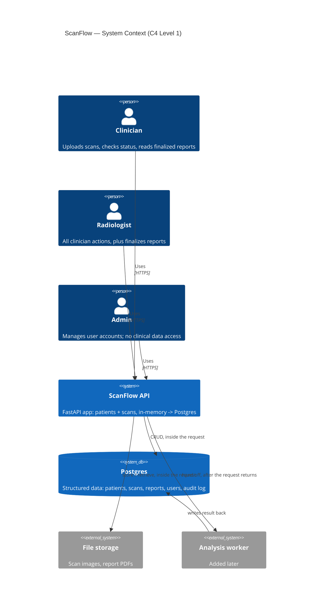
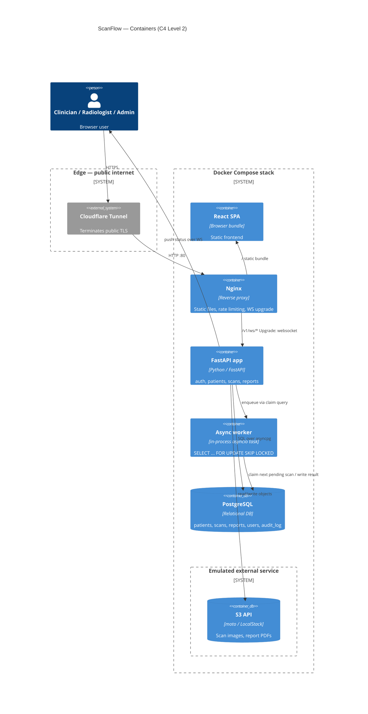
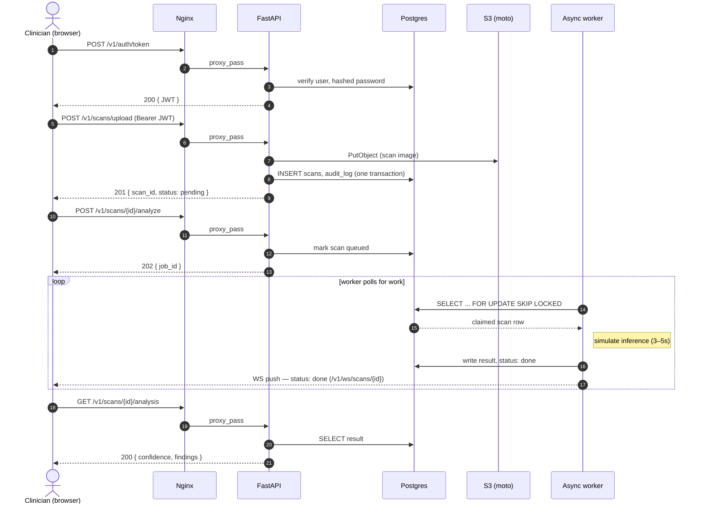
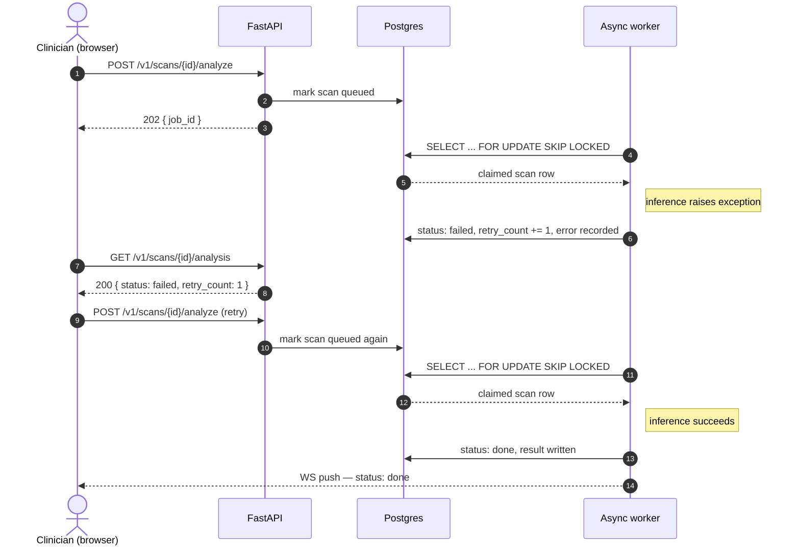

# ScanFlow — System Architecture

Radiology scan intake and analysis API. Requirements were settled in prose before any diagram was drawn — the diagrams below are a picture of those decisions, not a substitute for them.

## Table of contents
1. [Overview](#1-overview)
2. [Who uses it, and in which role](#2-who-uses-it-and-in-which-role)
3. [Components — this phase vs. later](#3-components--this-phase-vs-later)
4. [Where data lives, and where files live](#4-where-data-lives-and-where-files-live)
5. [Inside the request vs. afterwards](#5-inside-the-request-vs-afterwards)
6. [Diagram — system context (C4 level 1)](#6-diagram--system-context-c4-level-1)
7. [Diagram — containers (C4 level 2)](#7-diagram--containers-c4-level-2)
8. [Sequence — upload → analyze → retrieve](#8-sequence--upload--analyze--retrieve)
9. [Sequence — analysis fails and is retried](#9-sequence--analysis-fails-and-is-retried)
10. [Capacity estimate](#10-capacity-estimate)
11. [Failure modes](#11-failure-modes)

## 1. Overview

ScanFlow lets clinical staff upload radiology scans, have them analyzed, and read the resulting reports. It's one API behind one authentication scheme, backed by a relational store for structured data, blob storage for files, and a background worker for the one operation too slow to run inside a request.

This document is written in the order the system was actually decided: who uses it, what it's made of and when each part gets built, where data lives, and which operations are synchronous — in that order, because that last question is what determines the API surface, not the other way round.

## 2. Who uses it, and in which role

Three roles use ScanFlow. All three authenticate through the same scheme; authorization is enforced per-endpoint, not by standing up separate systems per role.

- **Clinician** — uploads scans, checks scan status, and reads finalized reports. This is the role that generates the most traffic.
- **Radiologist** — does everything a clinician can do, plus finalizes reports. It's the only role that can move a report from draft to final.
- **Admin** — manages user accounts, and deliberately has no special access to clinical data. Administering the system and reading patient data are treated as different privileges.

There is no anonymous or public role. Every request is made by an authenticated user acting in exactly one of these three roles.

## 3. Components — this phase vs. later

Five components make up the system. Only the first two exist in the current build phase; the API is deliberately shaped now so the rest can be added without renegotiating the endpoints later.

**Built now:**
- The FastAPI app itself — patients and scans endpoints — backed by in-memory storage.

**Added later, in this order:**
1. Real Postgres, replacing the in-memory store.
2. Auth (JWT, roles), added once storage is real.
3. The analysis worker — an async job pipeline, running as an in-process asyncio task that claims work via `SELECT ... FOR UPDATE SKIP LOCKED`.
4. A reverse proxy and containerization — Nginx and Docker Compose, exposed through a Cloudflare Tunnel.
5. File storage on the real object-storage API — S3, emulated via moto/LocalStack.

The worker, the proxy, and object storage are named here on purpose — so the API leaves room for them — but nothing behind that line is implemented in this phase.

## 4. Where data lives, and where files live

Structured data and files are two different kinds of data, and they don't share a home.

- **Structured data** — patients, scans, reports, users, audit log — is the system of record and lives in Postgres. Anything that gets queried, filtered, or joined belongs here.
- **Files** — the scan image itself, and any report PDF — do not belong in a database row. They live on disk (a mounted volume early on, the S3 API once that phase lands), and the corresponding `scans` / `reports` row holds only a path or object key. A row carrying a multi-megabyte blob is the wrong shape for every query that doesn't need the blob.

## 5. Inside the request vs. afterwards

This is the decision that shapes the whole API surface, made explicitly rather than discovered by accident once the worker exists.

**Inside the request (synchronous)** — anything the caller needs confirmed before moving on: validating and persisting a patient or scan record, storing an uploaded file, authenticating. These stay synchronous because they're fast, and the caller has nothing useful to do until they're done.

**After the request returns (asynchronous, handed to the worker)** — running analysis on a scan. Inference is slow (3–5+ seconds, simulated), and holding an HTTP connection open for that is the wrong shape. So `POST /v1/scans/{id}/analyze` returns `202 Accepted` with a job id — "I've accepted this and will do it" — not `200` with a result. Patients and scans CRUD stay synchronous; there's no reason to make a caller poll for something that takes milliseconds.

## 6. Diagram — system context (C4 level 1)

Who talks to the system, and what it talks to. Solid relationships are wired in the current phase; the worker is named for the API's sake but built later.

## 7. Diagram — containers (C4 level 2)

The fuller picture, once the reverse proxy, worker, and public tunnel are in place.

## 8. Sequence — upload → analyze → retrieve

## 9. Sequence — analysis fails and is retried

## 10. Capacity estimate

Two scenarios, same method: state assumptions, do the arithmetic, find where it breaks. The point of this exercise is the arithmetic being visible and checkable, not the final numbers being precise — every number here is a stated assumption, not a measurement.

### 10.1 Shared assumptions (both scenarios)

- **Requests per scan journey:** 1 upload + 1 analyze request + 2 status/result polls ≈ **5 requests/scan** (auth is once per session and is amortized away — ignored here).
- **Daily traffic shape:** clinical upload volume is not uniform across the day. Assume **30% of daily volume lands in the single busiest hour** (a morning rush), and within that hour, arrivals burst at up to **3× the hour's own average rate**.
- **File sizes:** scan image ≈ **20 MB** average (DICOM-derived export); a finalized report PDF ≈ **0.5 MB**, produced for **80% of scans** (some scans don't reach a finalized report). Average bytes stored per scan = 20 MB + (0.8 × 0.5 MB) = **20.4 MB/scan**.
- **Operating pattern:** facility takes scans **365 days/year** (hospital-style, not a 5-day clinic).
- **Inference time:** 3–5s simulated; use **4s** as the average for arithmetic.
- **Worker model:** exactly one in-process asyncio task, processing jobs **serially** — no concurrency within the worker.
- **Row multipliers per scan:** 1 `scans` row; 0.8 `reports` rows (finalized only); 0.25 new `patients` rows (assume 1 new patient per 4 scans — the rest are returning patients); 4 `audit_log` rows (upload, analyze-request, analyze-result, retrieve).

### 10.2 Scenario A — 200 scans/day

**Requests and RPS**
- Total requests/day = 200 × 5 = **1,000 requests/day**.
- Busiest hour = 30% of daily volume = 300 requests → 300 ÷ 3,600s = **0.083 req/s** sustained in that hour.
- Peak burst within that hour = 0.083 × 3 ≈ **0.25 req/s** peak.
- **Conclusion:** trivial load for a single Uvicorn/FastAPI process (which handles low thousands of req/s for simple CRUD). No component of the request path is under any measurable pressure.

**Storage growth**
- Bytes/day = 200 scans × 20.4 MB = **4,080 MB/day ≈ 4.08 GB/day**.
- Bytes/year = 4.08 GB × 365 = **≈ 1,489 GB ≈ 1.49 TB/year**.

**Row counts (per year, 365 × daily rate)**
| Table | Rows/day | Rows/year |
|---|---|---|
| `scans` | 200 | 73,000 |
| `reports` | 160 (0.8 × 200) | 58,400 |
| `patients` (new) | 50 (0.25 × 200) | 18,250 |
| `audit_log` | 800 (4 × 200) | 292,000 |

All four tables stay in the tens-to-hundreds-of-thousands of rows per year — trivial for a single unpartitioned Postgres instance for many years.

**Worker throughput required**
- Compute-seconds needed/day = 200 × 4s = **800s ≈ 13.3 minutes/day** of worker busy-time.
- Worst case, concentrated in the busiest hour (30% of jobs = 60 jobs): 60 × 4s = **240s = 4 minutes** of busy-time inside a 3,600s hour → **6.7% utilization at peak**.
- Theoretical max serial throughput = 3,600s ÷ 4s = **900 jobs/hour**. Required peak = 60 jobs/hour. Massive headroom (15×).

**First bottleneck at 200/day:** none of the software components. The system is over-provisioned everywhere; if anything constrains throughput at this scale, it's radiologists reading and finalizing reports, not the infrastructure.

### 10.3 Scenario B — 20,000 scans/day (100×)

**Requests and RPS**
- Total requests/day = 20,000 × 5 = **100,000 requests/day**.
- Busiest hour = 30% = 30,000 requests → 30,000 ÷ 3,600s = **8.3 req/s** sustained.
- Peak burst = 8.3 × 3 ≈ **25 req/s**.
- **Conclusion:** still comfortably inside what a single well-tuned FastAPI/Uvicorn process can serve for lightweight CRUD (low-to-mid hundreds of req/s per worker process is typical), though at this point running more than one Uvicorn worker process behind Nginx stops being optional headroom and becomes a reasonable default. This is a soft constraint, not a wall.

**Storage growth**
- Bytes/day = 20,000 × 20.4 MB = **408,000 MB/day = 408 GB/day**.
- Bytes/year = 408 GB × 365 = **≈ 148,920 GB ≈ 148.9 TB/year**.
- **Conclusion:** a mounted volume is no longer viable at all; object storage with lifecycle tiering (hot → cold/archive) stops being "the later phase" and becomes a day-one requirement, and retention policy (how long scans must legally be kept, and whether older studies move to cheaper storage classes) becomes an active decision, not an afterthought.

**Row counts (per year)**
| Table | Rows/day | Rows/year |
|---|---|---|
| `scans` | 20,000 | 7,300,000 |
| `reports` | 16,000 | 5,840,000 |
| `patients` (new) | 5,000 | 1,825,000 |
| `audit_log` | 80,000 | 29,200,000 |

Postgres handles tens of millions of rows in `scans`/`reports`/`patients` without structural changes. `audit_log` at ~29M rows/year is the first table where, after a couple of years, index bloat and vacuum times start to matter — **time-based partitioning of `audit_log` (e.g., monthly)** becomes worth doing proactively, though it is not an immediate hard failure.

**Worker throughput required — this is where it breaks**
- Compute-seconds needed/day = 20,000 × 4s = **80,000s ≈ 22.2 hours/day** of serial compute, against 24 available hours/day. On paper, if load were perfectly flat across all 24 hours, one serial worker would *just barely* fit (22.2 < 24) — but clinical demand isn't flat.
- Busiest hour = 30% of jobs = **6,000 jobs**. Compute-seconds needed in that one hour = 6,000 × 4s = **24,000s = 6.67 hours** of compute — inside a single 3,600s (1-hour) window.
- A single serial worker can supply at most 3,600s of compute per hour. Required: 24,000s. **Shortfall: the worker needs to be ~6.7× faster than it is** (i.e., ~7 concurrent workers) just to keep the queue from growing during the busy hour.
- Concretely: theoretical max throughput of one serial worker is **900 jobs/hour** (from 10.2); the busiest hour demands **6,000 jobs/hour** — nowhere close. The backlog grows continuously through the busy period and only drains (if it ever fully drains) once demand drops off-peak.

**First bottleneck at 20,000/day:** the single in-process asyncio worker, unambiguously and by a wide margin — it is roughly an order of magnitude short of peak demand, while the API tier and Postgres both still have comfortable headroom. The second bottleneck, close behind, is raw storage volume and the lack of a lifecycle/tiering policy. `SELECT ... FOR UPDATE SKIP LOCKED` was chosen specifically so the fix (running several worker processes/containers pulling from the same queue) is a scale-out, not a redesign.

### 10.4 Summary

| | 200 scans/day | 20,000 scans/day |
|---|---|---|
| Peak req/s | ~0.25 | ~25 |
| Storage/year | ~1.49 TB | ~148.9 TB |
| `audit_log` rows/year | ~292,000 | ~29,200,000 |
| Worker compute needed, busiest hour | 240s (6.7% of capacity) | 24,000s (**667% of capacity**) |
| First bottleneck | None — over-provisioned | Async worker concurrency, then storage lifecycle |

## 11. Failure modes

This table is the backbone of the Day 34 runbook: for each component, what breaks, what the user sees, what heals itself, and what a human has to do.

| Component | What happens when it fails | What the user sees | Self-recovers? | Needs a human? | Data at risk? |
|---|---|---|---|---|---|
| **Nginx** | Reverse proxy process dies or hangs | Tunnel returns an error; effectively no response | Yes — `restart: unless-stopped` | Only if it keeps crash-looping on restart | None — Nginx holds no state |
| **API (FastAPI)** | Process dies or crashes mid-request | 502 from Nginx for any in-flight or new request | Yes — restart policy brings a fresh process up | Only if it loops on startup (e.g. bad config, migration mismatch) | None for a clean crash — the in-flight DB transaction rolls back, so nothing is left half-written. *Today (in-memory phase): a crash loses all data outright, since there is no durable store yet* |
| **Async worker** | Process dies mid-job (no heartbeat mechanism) | The job stays stuck at "running" forever; user sees it simply never finish | No — nothing detects or restarts it automatically | Always — a human has to notice (or an alert has to fire) and restart the container | None once restarted — the row is re-claimed automatically via `SELECT ... FOR UPDATE SKIP LOCKED`; transactional writes prevent a half-written result. Time is lost (the job sat stuck), not data |
| **Postgres** | Process/container dies, or the DB becomes unreachable | 500 on any DB-touching call; `/healthz` fails | Yes, if the underlying volume is intact — restart brings it back with all data | Only if the volume or the disk itself is damaged | Safe as long as the volume persists; lost entirely only if the volume is deleted or corrupted with no backup |
| **Object storage (S3 API — moto/LocalStack today)** | Emulator/service becomes unreachable | Upload and analysis-result endpoints return 502/500 | Depends on the emulator/service restarting on its own — not guaranteed in this setup | Usually yes, in the current local setup | An uploaded file is at risk only if the `PutObject` succeeded but the DB row was never committed (or vice versa) — an orphaned object or a dangling reference with no file behind it |
| **Cloudflare Tunnel** | `cloudflared` process stops | The public URL goes dark immediately, with no error page — just unreachable | No — it's stateless and ephemeral by design | Always — a human (or a supervisor process) has to restart `cloudflared` | None — the tunnel carries no state of its own |
