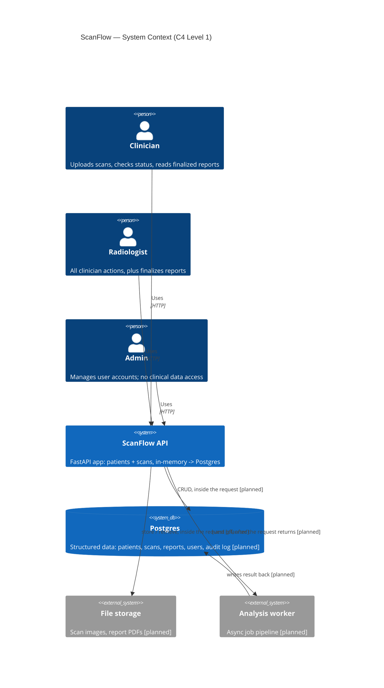
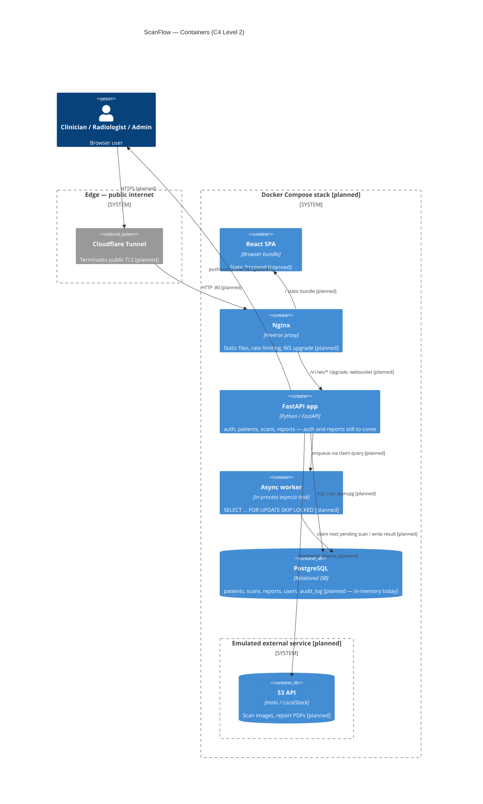

## Diagram — system context (C4 level 1)

```mermaid
C4Context
  title ScanFlow — System Context (C4 Level 1)

  Person(clinician, "Clinician", "Uploads scans, checks status, reads finalized reports")
  Person(radiologist, "Radiologist", "All clinician actions, plus finalizes reports")
  Person(admin, "Admin", "Manages user accounts; no clinical data access")

  System(scanflow, "ScanFlow API", "FastAPI app: patients + scans, in-memory -> Postgres")
  SystemDb(postgres, "Postgres", "Structured data: patients, scans, reports, users, audit log [planned]")
  System_Ext(filestore, "File storage", "Scan images, report PDFs [planned]")
  System_Ext(worker, "Analysis worker", "Async job pipeline [planned]")

  Rel(clinician, scanflow, "Uses", "HTTP")
  Rel(radiologist, scanflow, "Uses", "HTTP")
  Rel(admin, scanflow, "Uses", "HTTP")

  Rel(scanflow, postgres, "CRUD, inside the request [planned]")
  Rel(scanflow, filestore, "store / retrieve, inside the request [planned]")
  Rel(scanflow, worker, "hand off, after the request returns [planned]")
  Rel(worker, postgres, "writes result back [planned]")

  UpdateLayoutConfig("landscape")
```

## Diagram — containers (C4 level 2)

```mermaid
C4Container
  title ScanFlow — Containers (C4 Level 2)

  Person(user, "Clinician / Radiologist / Admin", "Browser user")

  System_Boundary(edge, "Edge — public internet") {
    System_Ext(tunnel, "Cloudflare Tunnel", "Terminates public TLS [planned]")
  }

  System_Boundary(compose, "Docker Compose stack [planned]") {
    Container(spa, "React SPA", "Browser bundle", "Static frontend [planned]")
    Container(nginx, "Nginx", "Reverse proxy", "Static files, rate limiting, WS upgrade [planned]")
    Container(api, "FastAPI app", "Python / FastAPI", "auth, patients, scans, reports — auth and reports still to come")
    Container(worker, "Async worker", "in-process asyncio task", "SELECT ... FOR UPDATE SKIP LOCKED [planned]")
    ContainerDb(db, "PostgreSQL", "Relational DB", "patients, scans, reports, users, audit_log [planned — in-memory today]")

    System_Boundary(emulated, "Emulated external service [planned]") {
      ContainerDb(s3, "S3 API", "moto / LocalStack", "Scan images, report PDFs [planned]")
    }
  }

  Rel(user, tunnel, "HTTPS [planned]")
  Rel(tunnel, nginx, "HTTP :80 [planned]")
  Rel(nginx, spa, "/ static bundle [planned]")
  Rel(nginx, api, "/v1/* proxy_pass [planned]")
  Rel(nginx, api, "/v1/ws/* Upgrade: websocket [planned]")

  Rel(api, db, "SQL over asyncpg [planned]")
  Rel(api, worker, "enqueue via claim query [planned]")
  Rel(worker, db, "claim next pending scan / write result [planned]")
  Rel(api, s3, "read/write objects [planned]")
  Rel(api, user, "push status over WS [planned]")

  UpdateLayoutConfig("landscape")
```