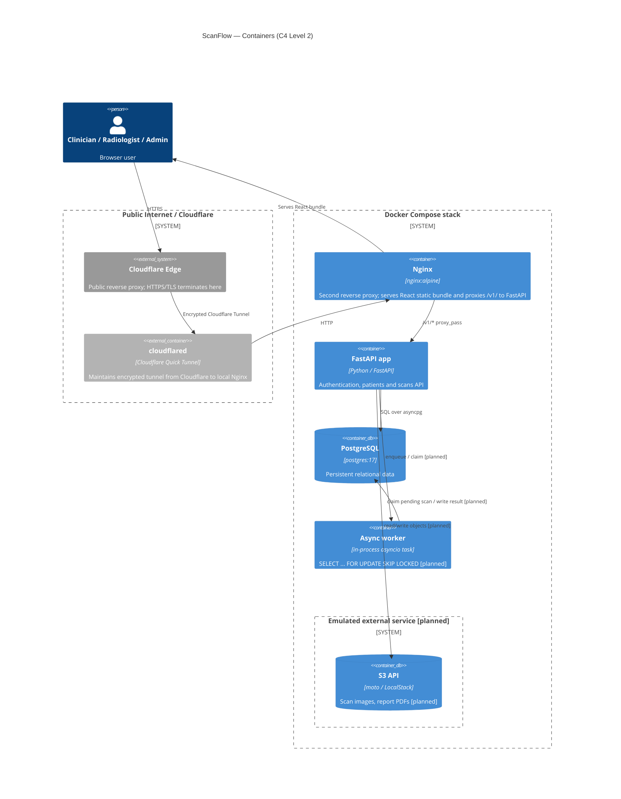

## Diagram — system context (C4 level 1)

```mermaid
```mermaid
C4Container
  title ScanFlow — Containers (C4 Level 2)

  Person(user, "Clinician / Radiologist / Admin", "Browser user")

  System_Boundary(edge, "Public Internet / Cloudflare") {
    System_Ext(cloudflare, "Cloudflare Edge", "Public reverse proxy; HTTPS/TLS terminates here")
    Container_Ext(cloudflared, "cloudflared", "Cloudflare Quick Tunnel", "Maintains encrypted tunnel from Cloudflare to local Nginx")
  }

  System_Boundary(compose, "Docker Compose stack") {
    Container(nginx, "Nginx", "nginx:alpine", "Second reverse proxy; serves React static bundle and proxies /v1/ to FastAPI")
    Container(api, "FastAPI app", "Python / FastAPI", "Authentication, patients and scans API")
    ContainerDb(db, "PostgreSQL", "postgres:17", "Persistent relational data")

    Container(worker, "Async worker", "in-process asyncio task", "SELECT ... FOR UPDATE SKIP LOCKED [planned]")

    System_Boundary(emulated, "Emulated external service [planned]") {
      ContainerDb(s3, "S3 API", "moto / LocalStack", "Scan images, report PDFs [planned]")
    }
  }

  Rel(user, cloudflare, "HTTPS")
  Rel(cloudflare, cloudflared, "Encrypted Cloudflare Tunnel")
  Rel(cloudflared, nginx, "HTTP")
  Rel(nginx, user, "Serves React bundle")
  Rel(nginx, api, "/v1/* proxy_pass")
  Rel(api, db, "SQL over asyncpg")

  Rel(api, worker, "enqueue / claim [planned]")
  Rel(worker, db, "claim pending scan / write result [planned]")
  Rel(api, s3, "read/write objects [planned]")

  UpdateLayoutConfig("landscape")
```