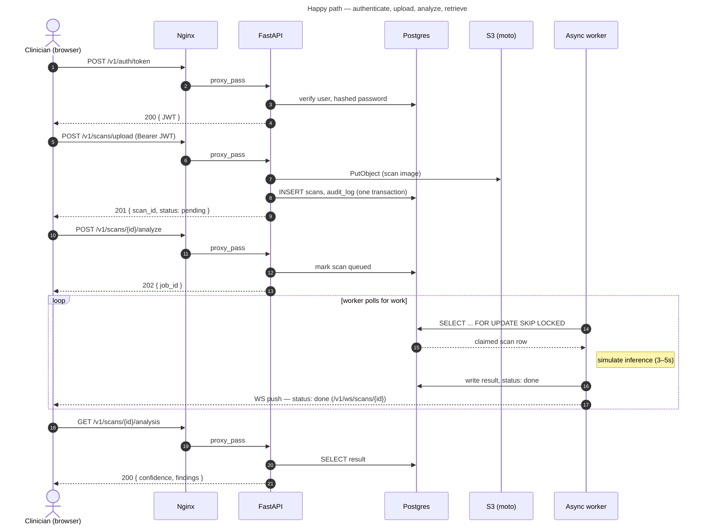
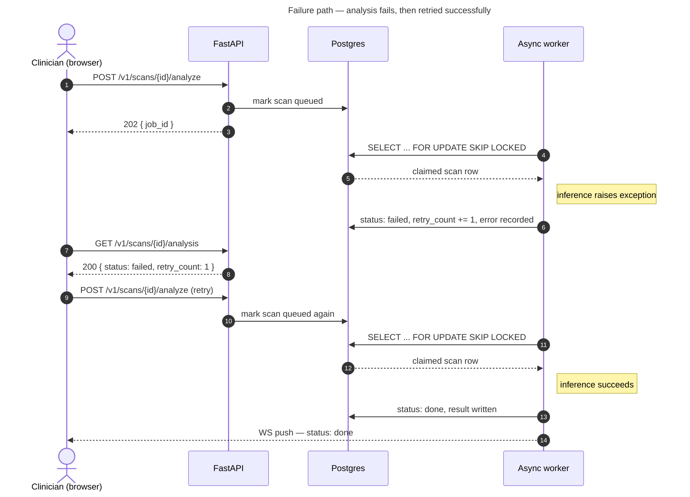

## Sequence — happy path

```mermaid
sequenceDiagram
    title Happy path — authenticate, upload, analyze, retrieve
    autonumber
    actor C as Clinician (browser)
    participant N as Nginx
    participant F as FastAPI
    participant P as Postgres
    participant S as S3 (moto)
    participant W as Async worker

    C->>N: POST /v1/auth/token
    N->>F: proxy_pass
    F->>P: verify user, hashed password
    F-->>C: 200 { JWT }

    C->>N: POST /v1/scans/upload (Bearer JWT)
    N->>F: proxy_pass
    F->>S: PutObject (scan image)
    F->>P: INSERT scans, audit_log (one transaction)
    F-->>C: 201 { scan_id, status: pending }

    C->>N: POST /v1/scans/{id}/analyze
    N->>F: proxy_pass
    F->>P: mark scan queued
    F-->>C: 202 { job_id }

    loop worker polls for work
        W->>P: SELECT ... FOR UPDATE SKIP LOCKED
        P-->>W: claimed scan row
        Note right of W: simulate inference (3–5s)
        W->>P: write result, status: done
        W-->>C: WS push — status: done (/v1/ws/scans/{id})
    end

    C->>N: GET /v1/scans/{id}/analysis
    N->>F: proxy_pass
    F->>P: SELECT result
    F-->>C: 200 { confidence, findings }
```

## Sequence — failure and retry

```mermaid
sequenceDiagram
    title Failure path — analysis fails, then retried successfully
    autonumber
    actor C as Clinician (browser)
    participant F as FastAPI
    participant P as Postgres
    participant W as Async worker

    C->>F: POST /v1/scans/{id}/analyze
    F->>P: mark scan queued
    F-->>C: 202 { job_id }

    W->>P: SELECT ... FOR UPDATE SKIP LOCKED
    P-->>W: claimed scan row
    Note right of W: inference raises exception
    W->>P: status: failed, retry_count += 1, error recorded

    C->>F: GET /v1/scans/{id}/analysis
    F-->>C: 200 { status: failed, retry_count: 1 }

    C->>F: POST /v1/scans/{id}/analyze (retry)
    F->>P: mark scan queued again
    W->>P: SELECT ... FOR UPDATE SKIP LOCKED
    P-->>W: claimed scan row
    Note right of W: inference succeeds
    W->>P: status: done, result written
    W-->>C: WS push — status: done
```